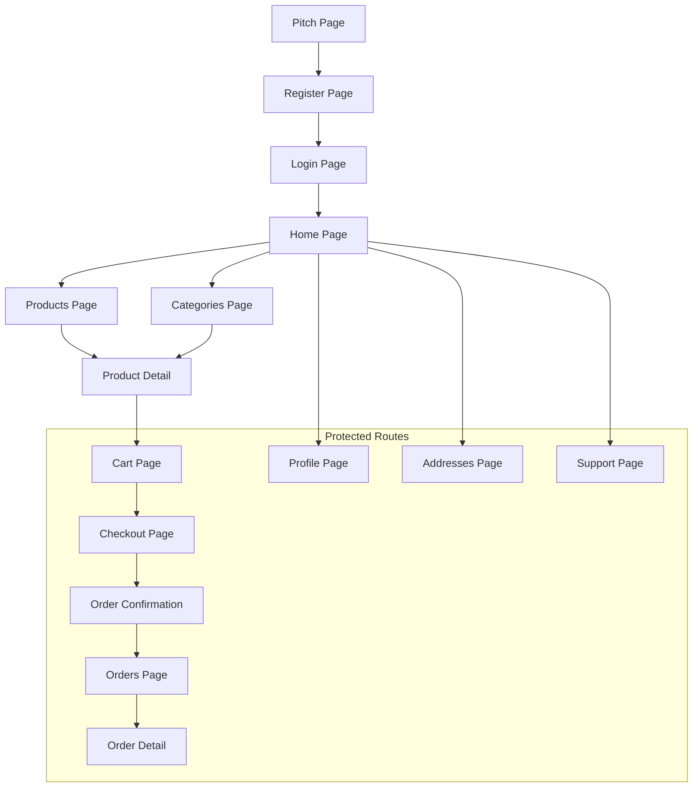

## 1. Product Overview
BUILD-SETU is a hyperlocal marketplace for construction materials, initially focused on Gwalior, India. The platform connects buyers (contractors, builders, homeowners) with verified suppliers of construction materials like cement, steel, bricks, and sand.

The product solves the problem of fragmented construction material supply chains by providing a centralized platform for discovery, ordering, and delivery of construction materials with transparent pricing and reliable suppliers.

## 2. Core Features

### 2.1 User Roles
| Role | Registration Method | Core Permissions |
|------|---------------------|------------------|
| Buyer | Email registration | Browse products, place orders, manage addresses, view order history |
| Seller | Email registration | List products, manage inventory, view orders, update business profile |

### 2.2 Feature Module
Our marketplace requirements consist of the following main pages:
1. **Pitch page**: Marketing content explaining BUILD-SETU value proposition
2. **Login page**: Email/password authentication
3. **Register page**: User registration with role selection
4. **Home page**: Hero section, featured categories, product highlights
5. **Products page**: Product listing with filters and search
6. **Product detail page**: Individual product information and ordering
7. **Categories page**: Category browsing
8. **Cart page**: Shopping cart management
9. **Checkout page**: Order placement with address selection
10. **Orders page**: Order history and tracking
11. **Order detail page**: Individual order information
12. **Profile page**: User profile management
13. **Addresses page**: Delivery address management
14. **Support pages**: Help center and ticket management

### 2.3 Page Details
| Page Name | Module Name | Feature description |
|-----------|-------------|---------------------|
| Pitch page | Hero section | Display BUILD-SETU value proposition and key benefits for construction material procurement |
| Pitch page | Features section | Highlight key features like verified suppliers, timely delivery, competitive pricing |
| Login page | Login form | Accept email and password inputs with validation and authentication |
| Register page | Registration form | Collect user details including name, email, phone, password, and role selection |
| Home page | Hero section | Showcase marketplace value proposition with compelling visuals and CTAs |
| Home page | Featured categories | Display top construction material categories with quick access |
| Home page | Product highlights | Show featured or popular products with pricing information |
| Products page | Product grid | Display products in card format with name, price, unit, and add to cart functionality |
| Products page | Filters | Provide category dropdown and search functionality for product discovery |
| Product detail page | Product information | Show detailed product description, specifications, pricing, and images |
| Product detail page | Quantity selector | Allow users to select quantity and add to cart |
| Cart page | Cart items list | Display selected products with quantity controls and line totals |
| Cart page | Order summary | Calculate and display subtotal, taxes, delivery charges, and grand total |
| Checkout page | Address selection | Allow users to select or add delivery address for order |
| Checkout page | Order confirmation | Display final order summary and place order functionality |
| Orders page | Order list | Show user's order history with status information |
| Order detail page | Order information | Display detailed order information including items, totals, and delivery status |
| Profile page | Profile management | Allow users to view and edit personal information |
| Addresses page | Address management | Enable users to add, edit, and delete delivery addresses |
| Support page | Ticket list | Display user's support tickets and status |
| Support detail page | Ticket details | Show individual ticket information and conversation history |

## 3. Core Process
### Buyer Flow
1. User lands on pitch page to understand BUILD-SETU value proposition
2. User registers as buyer with email, password, and basic information
3. User browses products by category or searches for specific materials
4. User adds products to cart with desired quantities
5. User proceeds to checkout, selects delivery address
6. User places order and receives confirmation
7. User tracks order status through orders page
8. User can manage profile and addresses for future orders

### Seller Flow
1. User registers as seller with business information
2. Seller lists construction materials with pricing and inventory
3. Seller manages incoming orders through dashboard
4. Seller updates order status as materials are delivered

## 4. User Interface Design

### 4.1 Design Style
- **Primary colors**: Deep blue (#1e40af) for primary actions, orange (#ea580c) for CTAs
- **Secondary colors**: Gray (#6b7280) for secondary text, light gray (#f3f4f6) for backgrounds
- **Button style**: Rounded corners (8px radius), solid fill for primary actions, outlined for secondary
- **Font**: Inter for body text, bold weights for headings (600-700)
- **Layout style**: Card-based design with generous whitespace, mobile-first responsive grid
- **Icons**: Construction-themed icons (hammer, bricks, cement mixer) using Heroicons or similar

### 4.2 Page Design Overview
| Page Name | Module Name | UI Elements |
|-----------|-------------|-------------|
| Home page | Hero section | Full-width hero with construction imagery, headline text in bold typography, primary CTA button in orange |
| Products page | Product grid | Responsive grid (1 column mobile, 2-3 tablet, 4 desktop), card shadows on hover, clear pricing display |
| Product detail page | Product information | Large product image, prominent price display, detailed specifications in organized sections |
| Cart page | Cart items | Clean table layout with quantity steppers, clear line totals, sticky order summary |
| Checkout page | Address selection | Form with clear field labels, address validation, order summary sidebar |
| Profile page | Profile form | Clean form layout with save button, role badge display, logout button in danger style |

### 4.3 Responsiveness
- **Desktop-first approach**: Design for desktop screens first, then adapt for mobile
- **Mobile optimization**: Touch-friendly buttons (minimum 44px height), simplified navigation
- **Breakpoints**: 640px (mobile), 768px (tablet), 1024px (desktop)
- **Grid system**: 12-column grid with responsive gutters and margins