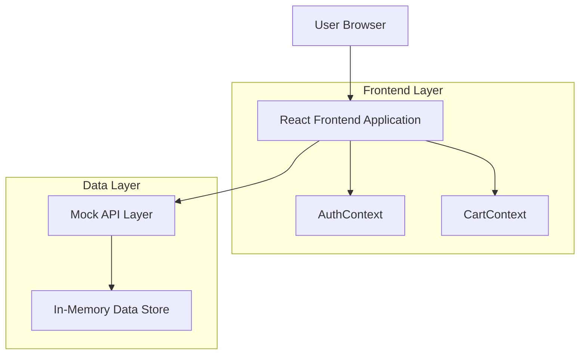

## 1. Architecture design



## 2. Technology Description

* Frontend: React\@18 + TypeScript + Tailwind CSS\@3 + Vite

* Initialization Tool: vite-init

* UI Components: shadcn/ui (Radix-based components)

* State Management: React Context (AuthContext, CartContext)

* Data Fetching: @tanstack/react-query

* Notifications: sonner

* Routing: React Router

* Backend: None (Mock API layer for development)

## 3. Route definitions

| Route             | Purpose                                                |
| ----------------- | ------------------------------------------------------ |
| /pitch            | Marketing page explaining BUILD-SETU value proposition |
| /login            | User authentication with email/password                |
| /register         | User registration with role selection                  |
| /                 | Home page with hero, categories, and featured products |
| /products         | Product listing with filters and search                |
| /products/:id     | Individual product detail page                         |
| /categories       | Category list for browsing                             |
| /categories/:slug | Products filtered by specific category                 |
| /cart             | Shopping cart management                               |
| /checkout         | Order checkout flow with address selection             |
| /orders           | User's order history                                   |
| /orders/:id       | Individual order detail view                           |
| /support          | Support ticket list and help center                    |
| /support/:id      | Individual support ticket detail                       |
| /profile          | User profile management                                |
| /addresses        | Delivery address management                            |
| \*                | 404 Not Found page                                     |

## 4. API definitions

### 4.1 Authentication API

```
POST /api/auth/login
```

Request:

| Param Name | Param Type | isRequired | Description        |
| ---------- | ---------- | ---------- | ------------------ |
| email      | string     | true       | User email address |
| password   | string     | true       | User password      |

Response:

| Param Name | Param Type | Description                            |
| ---------- | ---------- | -------------------------------------- |
| user       | object     | User object with id, name, email, role |
| token      | string     | Authentication token                   |

Example:

```json
{
  "email": "user@example.com",
  "password": "password123"
}
```

```
POST /api/auth/register
```

Request:

| Param Name | Param Type | isRequired | Description                     |
| ---------- | ---------- | ---------- | ------------------------------- |
| name       | string     | true       | Full name                       |
| email      | string     | true       | Email address                   |
| phone      | string     | true       | Phone number                    |
| role       | string     | true       | User role ("buyer" or "seller") |
| password   | string     | true       | Password                        |

### 4.2 Products API

```
GET /api/products
```

Query Parameters:

| Param Name | Param Type | Description                |
| ---------- | ---------- | -------------------------- |
| category   | string     | Filter by category         |
| search     | string     | Search by product name     |
| page       | number     | Page number for pagination |
| limit      | number     | Items per page             |

```
GET /api/products/:id
```

### 4.3 Cart API

```
GET /api/cart
```

```
POST /api/cart/add
```

Request:

| Param Name | Param Type | Description     |
| ---------- | ---------- | --------------- |
| productId  | string     | Product ID      |
| quantity   | number     | Quantity to add |

```
PUT /api/cart/update
```

```
DELETE /api/cart/remove/:id
```

### 4.4 Orders API

```
POST /api/orders
```

Request:

| Param Name  | Param Type | Description         |
| ----------- | ---------- | ------------------- |
| items       | array      | Array of cart items |
| addressId   | string     | Delivery address ID |
| totalAmount | number     | Order total amount  |

```
GET /api/orders
```

```
GET /api/orders/:id
```

## 5. Context Architecture

### AuthContext Structure

```typescript
interface AuthContextType {
  user: User | null;
  loading: boolean;
  login: (email: string, password: string) => Promise<void>;
  register: (data: RegisterData) => Promise<void>;
  logout: () => void;
}

interface User {
  id: string;
  name: string;
  email: string;
  phone: string;
  role: "buyer" | "seller";
}
```

### CartContext Structure

```typescript
interface CartContextType {
  items: CartItem[];
  addItem: (productId: string, quantity: number) => void;
  removeItem: (productId: string) => void;
  updateQuantity: (productId: string, quantity: number) => void;
  clearCart: () => void;
  total: number;
}

interface CartItem {
  id: string;
  productId: string;
  name: string;
  price: number;
  quantity: number;
  unit: string;
}
```

## 6. Component Architecture

### Layout Components

* `Layout.tsx` - Main layout wrapper with navbar and footer

* `Navbar.tsx` - Navigation with logo, links, cart icon, profile menu

* `Footer.tsx` - Site footer with links and information

* `ProtectedRoute.tsx` - Route protection based on authentication

### UI Components (shadcn/ui wrappers)

* `Button.tsx` - Custom button wrapper

* `Card.tsx` - Product and content cards

* `Input.tsx` - Form input wrapper

* `Select.tsx` - Dropdown select wrapper

* `Badge.tsx` - Status and category badges

### Page Components

* `HomePage.tsx` - Landing page with hero and features

* `ProductsPage.tsx` - Product listing with filters

* `ProductDetailPage.tsx` - Individual product view

* `CartPage.tsx` - Shopping cart management

* `CheckoutPage.tsx` - Order checkout flow

## 7. Mock Data Structure

### Products

```typescript
interface Product {
  id: string;
  name: string;
  category: string;
  price: number;
  unit: string;
  description: string;
  image: string;
  inStock: boolean;
}
```

### Categories

```typescript
interface Category {
  id: string;
  name: string;
  slug: string;
  image: string;
  description: string;
}
```

### Orders

```typescript
interface Order {
  id: string;
  userId: string;
  items: OrderItem[];
  totalAmount: number;
  status: "pending" | "confirmed" | "delivered";
  address: Address;
  createdAt: string;
  updatedAt: string;
}
```

## 8. File Structure

```
src/
├── App.tsx
├── main.tsx
├── routes/
│   ├── index.tsx
│   ├── pitch.tsx
│   ├── login.tsx
│   ├── register.tsx
│   ├── home.tsx
│   ├── products.tsx
│   ├── product-detail.tsx
│   ├── categories.tsx
│   ├── cart.tsx
│   ├── checkout.tsx
│   ├── orders.tsx
│   ├── order-detail.tsx
│   ├── profile.tsx
│   ├── addresses.tsx
│   ├── support.tsx
│   └── support-detail.tsx
├── components/
│   ├── layout/
│   │   ├── Layout.tsx
│   │   ├── Navbar.tsx
│   │   └── Footer.tsx
│   ├── ui/
│   │   ├── Button.tsx
│   │   ├── Card.tsx
│   │   ├── Input.tsx
│   │   └── index.ts
│   └── ProtectedRoute.tsx
├── contexts/
│   ├── AuthContext.tsx
│   └── CartContext.tsx
├── hooks/
│   ├── useAuth.ts
│   └── useCart.ts
├── lib/
│   ├── api.ts
│   ├── mock-api.ts
│   └── utils.ts
└── types/
    ├── user.ts
    ├── product.ts
    ├── order.ts
    └── index.ts
```

